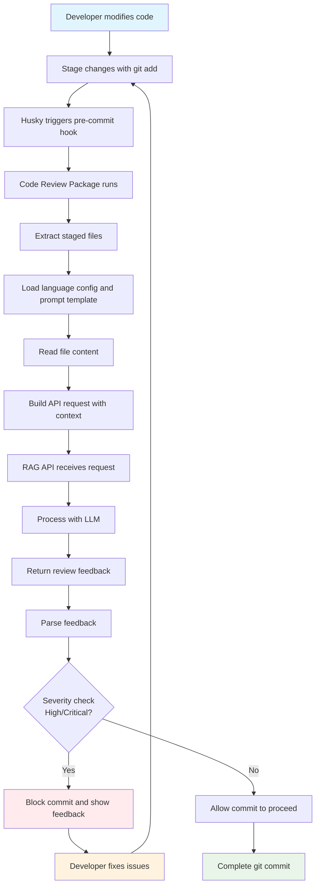

# @jc-vendor/code-review Documentation

Welcome to the documentation for the `@jc-vendor/code-review` package. This comprehensive code review tool integrates with Git hooks via Husky and leverages a RAG API for intelligent code analysis.

## Table of Contents
- [Overview](#overview)
- [Features](#features)
- [Installation](#installation)
- [Usage](#usage)
- [Workflow](#workflow)
- [Configuration](#configuration)
- [API Integration](#api-integration)
- [Additional Resources](#additional-resources)

## Overview

The `@jc-vendor/code-review` package is a comprehensive code review tool that integrates with Git hooks via Husky and leverages a RAG API for intelligent code analysis. It supports multiple programming languages including JavaScript, TypeScript, Java, Kotlin, Swift, Python, and more.

## Features

- Multi-language support (JavaScript, TypeScript, Java, Kotlin, Swift, Objective-C, Python, Shell, Groovy and many more)
- Integration with Husky for Git hooks
- RAG API-powered code review capabilities
- Pre-commit hook validation
- Command-line interface for manual reviews
- Non-destructive hook installation (appends to existing hooks instead of replacing them)
- Configurable language support via JSON configuration
- Multiple code review templates for different purposes (security, best practices, style, performance, etc.)
- Automated extraction of ticket IDs and additional context from Git metadata

## Installation

```bash
npm install @jc-vendor/code-review
```

## Usage

### Command Line Interface

```bash
# Review all files in the current directory with security-focused template (default)
npx @jc-vendor/code-review

# Review specific files with a specific template
npx @jc-vendor/code-review --files src/file1.js src/file2.ts --template best-practices

# Review a specific directory with performance-focused template
npx @jc-vendor/code-review --path ./src --template performance

# List available templates
npx @jc-vendor/code-review list-templates

# Specify custom API endpoint and host
npx @jc-vendor/code-review --host http://your-rag-api.com --endpoint /api/v1/query --template comprehensive

# Include ticket ID and additional information
npx @jc-vendor/code-review --ticket-id "PROJ-123" --additional-info "This addresses the authentication vulnerability"
```

### With Husky Integration

To automatically run code reviews before commits:

1. Install Husky:
```bash
npm install --save-dev husky
```

2. Enable Git hooks:
```bash
npx husky install
```

3. Install the pre-commit hook with a specific template:
```bash
npx @jc-vendor/code-review --install-hook --template security
```

> **Note:** If your project already has a pre-commit hook configured, the `--install-hook` command will append the code review command to the existing hook instead of replacing it. The command checks for duplicates to prevent multiple insertions.

## Workflow

The package follows an optimized workflow that minimizes developer intervention while maintaining code quality:

### 1. One-time Setup
```bash
# Install husky and the code review package
npm install --save-dev husky @jc-vendor/code-review

# Enable husky
npx husky install

# Install the pre-commit hook with default security template
npx @jc-vendor/code-review install-hook --template security
```

### 2. Daily Development Flow
```bash
# Developer makes changes
# Edit files...

# Stage changes
git add .

# Commit (triggers pre-commit hook automatically)
git commit -m "Fix user login issue #123"
# <-- At this point, code review happens automatically!

# Push changes
git push origin main
```

### Workflow Diagram



### Automated Context Extraction

The package can automatically extract context from Git metadata:

- **Ticket IDs**: Extracted from commit messages (e.g., `#123`, `PROJ-123`)
- **Branch Context**: Extracted from branch names (e.g., `feature/PROJ-123-fix-authentication`)
- **Commit Message**: Full commit message is included as additional context

To disable automatic extraction, set the environment variable:
```bash
export AUTO_EXTRACT_TICKET_ID=false
```

## Configuration

### Language Support Configuration

The package supports configurable language detection via the `languages.json` file. This file defines which file extensions map to which programming languages. You can modify this file to add or remove language support according to your project needs.

### Prompt Template Configuration

The package supports multiple code review templates for different purposes:

- **security**: Focuses on identifying potential security vulnerabilities, injection attacks, authentication/authorization issues, and data protection concerns
- **best-practices**: Reviews for adherence to language-specific best practices, design patterns, maintainability, readability, and performance
- **style**: Evaluates code for consistency in formatting, naming conventions, indentation, and overall code style
- **performance**: Analyzes code for performance bottlenecks, inefficient algorithms, memory usage, and optimization opportunities
- **maintainability**: Assesses code for maintainability factors such as modularity, complexity, documentation, and ease of modification
- **comprehensive**: Performs a thorough review covering security, best practices, performance, maintainability, style, and potential bugs

You can customize these templates by modifying the `prompt-templates.json` file.

### API Configuration

The package connects to your RAG API with the following defaults:
- Endpoint: `/api/v1/query`
- Host: `http://localhost:8080`

These can be customized via CLI flags or environment variables.

## API Integration

This package communicates with your RAG API via the `/api/v1/query` endpoint. The API should expect a POST request with the following JSON structure:

```json
{
  "query": "string",
  "stream": false,
  "context": [
    {
      "additionalProp1": {
        "fileName": "string",
        "language": "string",
        "template": "string",
        "ticketId": "string",
        "additionalInfo": "string"
      }
    }
  ]
}
```

And respond with:

```json
{
  "feedback": "review feedback",
  "suggestions": ["list", "of", "suggestions"],
  "severity": "low|medium|high|critical"
}
```

## Additional Resources

- [Local Installation Guide](local-installation.md) - Detailed instructions for installing the package locally during development
- [Husky Integration Guide](husky-integration.md) - Comprehensive guide to integrating with Husky for Git hooks
- [Workflow Diagram](workflow-diagram.md) - Detailed visualization of the code review workflow
- [Quick Reference](quick-reference.md) - Quick reference guide with common commands and options