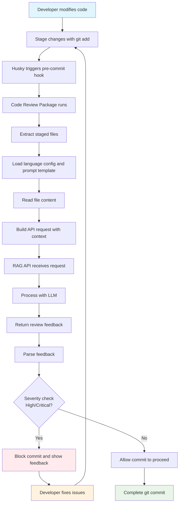

# Code Review Workflow Diagram

This document describes the workflow of the `@jc-vendor/code-review` package.

## Complete Workflow

## Description

This diagram illustrates the complete workflow of the code review package:

1. **Developer modifies code** - The developer writes code
2. **Stage changes with git add** - Changes are staged using git
3. **Husky triggers pre-commit hook** - When the developer runs `git commit`, Husky automatically triggers the pre-commit hook
4. **Code Review Package runs** - The code review package is executed as part of the hook
5. **Extract staged files** - The package identifies which files have been staged for commit
6. **Load language config and prompt template** - Loads configuration and the appropriate review template
7. **Read file content** - Reads the content of each staged file
8. **Build API request with context** - Constructs the request to send to the RAG API
9. **RAG API receives request** - The RAG API receives the code and review request
10. **Process with LLM** - The AI processes the code and generates feedback
11. **Return review feedback** - The API returns the review feedback
12. **Parse feedback** - The package parses the feedback from the API
13. **Severity check** - Determines if any issues are high/critical severity
14. **Block commit and show feedback** - If high/critical issues are found, the commit is blocked and feedback is displayed
15. **Allow commit to proceed** - If no critical issues are found, the commit continues
16. **Complete git commit** - The git commit is finalized
17. **Developer fixes issues** - If issues were found, the developer addresses them
18. **Developer returns to staging** - The developer goes back to the staging step after fixing issues